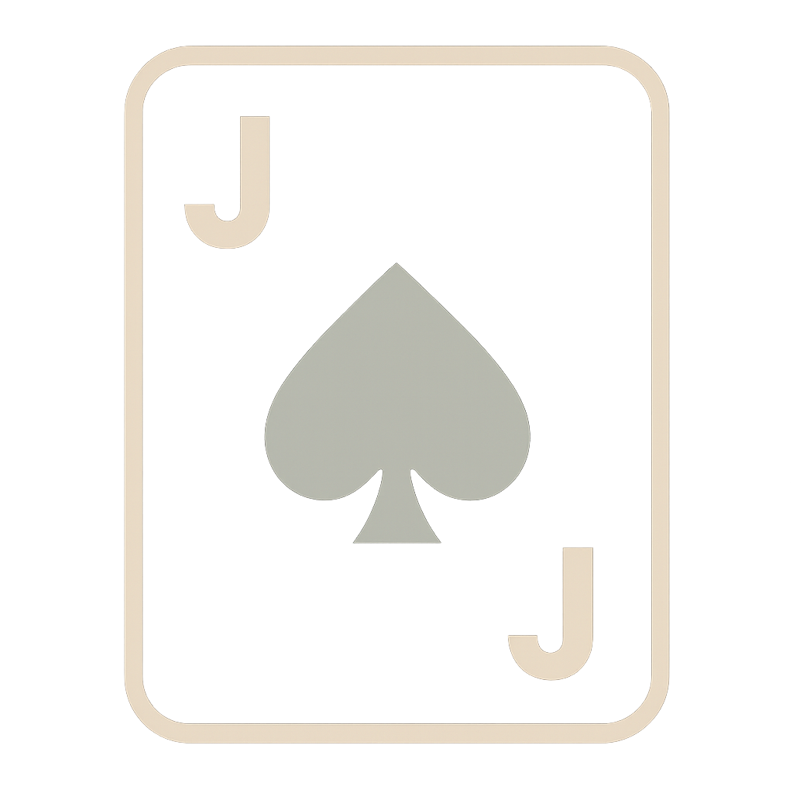
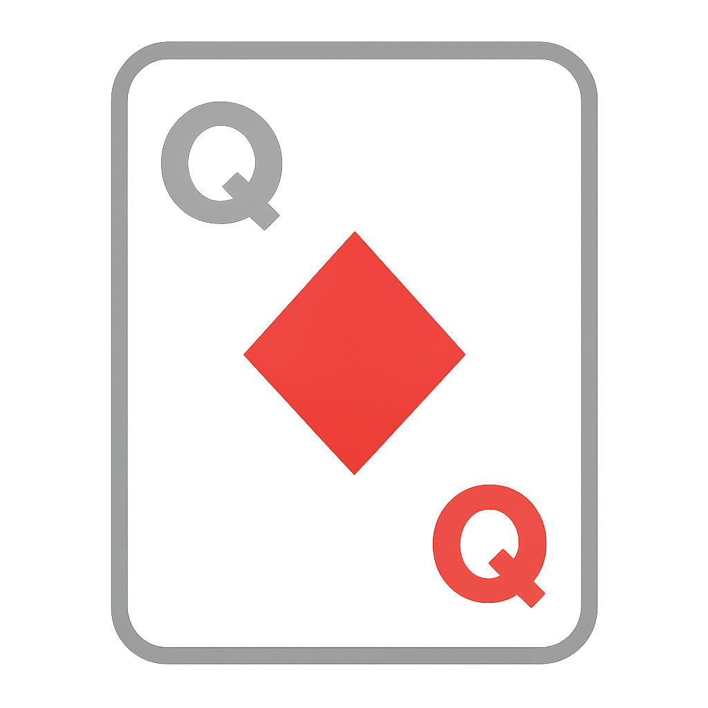
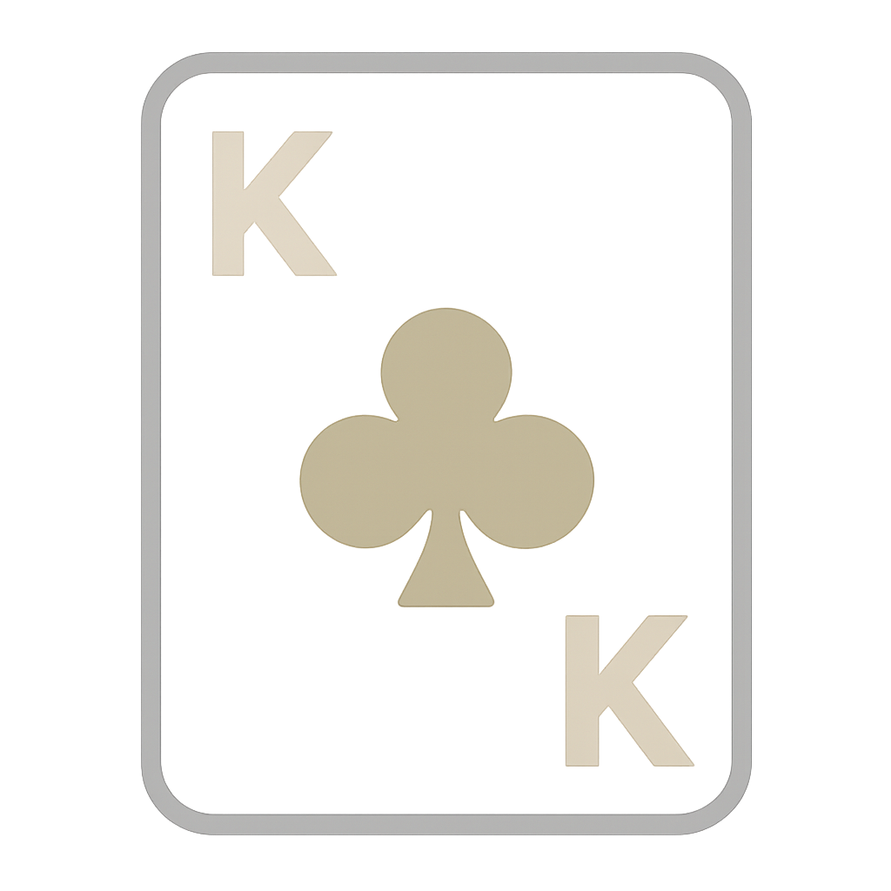

# A Reinforcement Learning Framework for Poker 

[Request Feature](https://github.com/shridpant/poker/issues) · [Report Bug](https://github.com/shridpant/poker/issues) · [Contributing](#contributing) · [License](#license)

This repository provides a flexible implementation of Kuhn Poker (extendable to other poker variations) with support for different player agent types, including human players, random agents, and reinforcement learning (RL) agents. The project is designed as a **plug-and-play system** to easily implement and test various ML algorithms in a simplified poker environment.

For more details on the engine’s internals, see [KuhnPokerEngine Documentation](engine/README.md).

For comprehensive details on training the three RL agents, see [FRL](players/federatedrl-readme.md), [CFR](players/cfr-readme.md), and [RG-NFSP](players/rgnfsp-readme.md).

## Table of Contents
- [Game Rules](#game-rules)
  - [Standard Kuhn Poker (2 Players)](#standard-kuhn-poker-2-players)
  - [Modified Kuhn Poker (3 Players)](#modified-kuhn-poker-3-players)
- [File Structure](#file-structure)
- [Installation & Requirements](#installation--requirements)
- [Running the Game](#running-the-game)
  - [2-Player Kuhn Poker Game](#2-player-kuhn-poker-game)
  - [3-Player Kuhn Poker Game](#3-player-game)
- [Adding Custom Agents](#adding-custom-agents)
- [Data Collection for Machine Learning](#data-collection-for-machine-learning)
- [Known Issues & Troubleshooting](#known-issues--troubleshooting)
- [References](#references)
- [Contributing](#contributing)
- [License](#license)

## Game Rules

   

### Standard Kuhn Poker (2 Players)
Kuhn poker is a simple poker variant played with just 3 cards: Jack (J), Queen (Q), and King (K).

1. **Setup**: 
   - Each player antes 1 chip to the pot and receives 1 card.
   - Cards are ranked from lowest to highest: J < Q < K.

2. **Gameplay**:
   - First betting round: Players can check or bet 1 chip.
   - If there's a bet, the other player can call or fold.
   - If both players check, cards are revealed (showdown).
   - If a player bets and the other calls, there's another betting round.

3. **Winner**: The highest card wins the pot. If a player folds, the other player wins automatically.

### Modified Kuhn Poker (3 Players)
Our 3-player variant uses a modified deck to create more strategic depth:

1. **Setup**:
   - Uses 4 cards: Jack (J), Queen (Q), King (K), and Ace (A). Cards are ranked from lowest to highest: J < Q < K < A.
   - 3 cards are dealt to players, and 1 card remains hidden.
   - This hidden card creates uncertainty, even the player with the King doesn't know if the Ace is in play. If a player does hold the Ace, they may disguise it or slow-play to extract more chips.

2. **Gameplay**:
   - Same basic mechanics as 2-player, but with 3 players taking turns
   - More complex betting dynamics due to multiple players

3. **Winner**: Highest card wins, or last remaining player if others fold.

## File Structure

```
poker/
├── engine/
│   ├── KuhnPokerEngine.py
│   └── ...
├── scripts/
│   ├── train.py
│   └── ...
├── players/
│   ├── base.py
│   ├── human_agent.py
│   ├── cfr_agent.py
│   ├── frl_agent.py
│   ├── rgnfsp_agent.py
│   └── ...
├── logs/
│   ├── game_log.txt
│   └── game_data/
├── data/
└── requirements.txt
```

## Installation & Requirements

1. Clone the repository:
   ```
   git clone https://github.com/shridpant/poker
   cd poker
   ```

2. Install dependencies:
   ```
   pip install -r requirements.txt
   ```

## Running the Game

There's an ```example.ipynb``` for you. We tried to make it super intuitive!

### 2-Player Kuhn Poker Game 

```python
from engine.game_engine import KuhnPokerEngine
from players.cfr_agent import CFRPlayerWrapper
from players.frl_agent import FRLAgent

# Initialize players
frl_agent = FRLAgent(player_id=0, state_dim=20, action_dim=5, variant="kuhn_3p")
cfr_agent = CFRPlayerWrapper(player_id=1, num_players=3)

# Load the FRL model
model_path = os.path.join("models", "frl-models", "best_frl_global.pt")
frl_agent.load_model(model_path)
# For inference only (pure exploitation)
frl_agent.epsilon = 0.01

engine = KuhnPokerEngine(
    player0=frl_agent,
    player1 = cfr_agent,
    delay=0.0,  
    num_players=2,
    auto_rounds=1  # None to ask for next round after each hand
)

engine.run_game()
```

### 3-Player Game 

```python
from engine.game_engine import KuhnPokerEngine
from players.cfr_agent import CFRPlayerWrapper
from players.frl_agent import FRLAgent
from players.rgnfsp_agent import RGNFSP3PPlayer

# Initialize players
frl_agent = FRLAgent(player_id=0, state_dim=20, action_dim=5, variant="kuhn_3p")
cfr_agent = CFRPlayerWrapper(player_id=1, num_players=3)
rgnfsp_agent = RGNFSP3PPlayer()

# Load the FRL model
model_path = os.path.join("models", "frl-models", "best_frl_global.pt")
frl_agent.load_model(model_path)
# For inference only (pure exploitation)
frl_agent.epsilon = 0.01

engine = KuhnPokerEngine(
    player0=frl_agent,
    player1=cfr_agent,
    player2=rgnfsp_agent,
    delay=0.0,
    num_players=3,
    auto_rounds=1
)

engine.run_game()
```

## Adding Custom Agents

The framework allows easy implementation of custom agents, including reinforcement learning and federated learning approaches.

### Basic Agent Structure

Create a new file in the `players/` directory and implement the required interface:

```python
from players.base import Player

class MyCustomAgent(Player):
    def __init__(self):
        # Initialize your agent
        pass
        
    def get_action(self, card, available_actions, round_num, chips_remaining):
        # Your decision-making logic here
        # Return action_idx or (action_idx, raise_amount) tuple
        return chosen_action_idx
```

### Adding an RL Agent

```python
class MyRLAgent(Player):
    def __init__(self):
        # Define model, optimizer, etc.
        self.model = self.create_model()  # Your model definition
        self.memory = []  # Experience replay buffer
        
    def create_model(self):
        # Define your neural network or other ML model
        pass
        
    def get_action(self, card, available_actions, round_num, chips_remaining):
        # Convert state to your model's input format
        state_tensor = self.preprocess_state(card, available_actions, round_num)
        # Use model for prediction
        q_values = self.model(state_tensor)
        # Select best valid action
        return self.select_action(q_values, available_actions)
        
    def train(self):
        # Training loop using collected experiences
        pass
```

## Data Collection for Machine Learning

RL agents **collect gameplay data primarily through self-play**. When running RL training scripts, each agent logs transitions from its own perspective. These transitions still follow the same specification outlined below to ensure consistency across agents.

Additionally, the system (KuhnPokerEngine) also automatically collects game data suitable for machine learning:

- **RL Data**: Sample transitions for RL are also stored in [logs/game_data/rl_data.csv](logs/game_data/rl_data.csv) with state, action, reward, and next state information. This *csv* is updated after each gameplay.

The state representation includes:
- Round number
- Game stage (first/second betting round)
- Current player
- Pot size
- Player's card
- Available actions
- Betting history
- Chip counts

### RL Data Format (`rl_data.csv`)

The `rl_data.csv` file contains detailed information about each decision made during the game. Below is a description of each column:

| Column Name      | Description                                                                 |
|------------------|-----------------------------------------------------------------------------|
| `session_id`     | Unique identifier for the game session (e.g., timestamp).                  |
| `round`          | The current round number within the session.                               |
| `decision_index` | The index of the decision within the round (e.g., 0 for the first decision).|
| `stage`          | The stage of the round (`first` or `second` betting round).                |
| `current_player` | The player making the decision at this step (e.g., 0, 1, or 2).            |
| `state`          | Serialized representation of the game state at the time of the decision.   |
| `legal_actions`  | List of valid actions available to the player at this step.                |
| `chosen_action`  | The action chosen by the player (encoded as an integer).                   |
| `reward`         | The reward received for this action (e.g., chips won or lost).             |
| `done`           | Boolean indicating whether the game or round has ended.                   |

#### Example Row
```csv
session_id,round,decision_index,stage,current_player,state,legal_actions,chosen_action,reward,done
20250329173312,1,0,first,0,"{'round': 1, 'stage': 'first', 'current_player': 0, 'player0_card': 1, 'player1_card': 2, 'player2_card': -1, 'pot': 2, 'chips': '9;9', 'betting_history': ''}","[0, 1]",0,0,False
```

## Known Issues & Troubleshooting

- **Action Display Issue**: Sometimes, for the human player, the available actions are not immediately shown. This can be remedied by pressing the "ESC" key and then entering the actual action.
  
- **Module Import Errors**: If you encounter import errors, make sure your working directory is set correctly.

## References
- **Paper Citations**:  
  - [AlphaHoldem: End-to-end Reinforcement Learning for Poker](https://cdn.aaai.org/ojs/20394/20394-13-24407-1-2-20220628.pdf)  

- **Implementation Examples**:  
  - [PyTorch Official Tutorials](https://pytorch.org/tutorials/)  
  - [W&B Documentation](https://docs.wandb.ai/)

## Contributing
[Pull requests](https://github.com/shridpant/poker/pulls) are welcome. For major changes, please open an issue first.

## License
This project is licensed under the MIT License. Please the [LICENSE](LICENSE) file for details.
