# Externally Sampled CFR with Neural Raise Optimization

## 1. Agent Overview

This is a **Counterfactual Regret Minimisation (CFR)** agent for imperfect–information poker that combines

1. **Externally-sampled CFR** – traverses only one randomly-sampled chance / opponent branch per iteration, giving ≈ ×10-×100 speed-ups over vanilla CFR on large trees.
2. **Neural dynamic-raise module** – removes the usual “fixed raise buckets” limitation by predicting a continuous-valued raise size conditioned on the current game state.

The result is a sample-efficient learner that scales from classic 2-player Kuhn poker to 3-player variants while preserving a rich action space.

---

## 2. Repository layout

```
.
├── engine/                      # Poker environment
│   └── KuhnPokerEngine.py
├── players/
│   └── cfr_agent.py             # Everything described in this README
├── logs/
│   └── game_data/               # Strategies, NN checkpoints & plots
└── README.md
```

Key classes inside **players/cfr\_agent.py**&#x20;

| Class / fn           | Purpose                                                                                                                                                                   |
| -------------------- | ------------------------------------------------------------------------------------------------------------------------------------------------------------------------- |
| `RaiseValueNetwork`  | 14-➜32–32-➜1 MLP (sigmoid) that outputs a *fraction* ∈ (0, 1) of the stack to raise.                                                                                      |
| `EnhancedCFRTrainer` | Stand-alone trainer that produces a JSON strategy file and a convergence plot.                                                                                            |
| `AdvancedCFRAgent`   | Runtime agent that: loads the CFR strategy → chooses an *action class* → if `raise`, queries the network for the amount → logs experiences and trains the network online. |
| `CFRPlayerWrapper`   | Lightweight bridge expected by `KuhnPokerEngine`.                                                                                                                         |
| `main` Arg-parser    | `--train` **or** `--play`, plus `--players` and `--iterations`.                                                                                                           |

---

## 3. Algorithmic background

### 3.1 Externally-sampled CFR (ESCFR)

At each decision node, chance and **all opponents but one** are *sampled*, while the traversing player enumerates its full action set. Regrets are updated by

$$
R^{t+1}(I,a)=R^t(I,a)+\bigl[v(I,a,\sigma_{-i}^t)-v(I,\sigma^t)\bigr]
$$

and the next policy is obtained by *regret-matching*

$$
\sigma^{t+1}(I,a)=\frac{R^{t,+}(I,a)}{\sum_b R^{t,+}(I,b)}\,.
$$

### 3.2 Neural raise optimisation

Whenever the discrete CFR policy returns **“raise”** the 14-dimensional feature vector

| Block             | Features (total = 14)   |
| ----------------- | ----------------------- |
| Card (4)          | one-hot $J,Q,K,A$       |
| Global (6)        | round#, stage, pos (3×) |
| Stack / pot (2)   | normalised pot, chips   |
| History (2)       | #bets, #folds           |
| Current round (1) | highest bet so far      |

is forwarded to the MLP. Training follows a replay-buffer + **reward-weighted MSE** loss; bad outcomes push the output away from harmful bet sizes.

---

## 4. Quick-start

### 4.1 Requirements

* Python ≥ 3.9
* PyTorch
* NumPy
* Matplotlib

### 4.2 Training a strategy

```bash
# 2-player, 100 k iterations
python players/cfr_agent.py --train --players 2 --iterations 100000

# 3-player, 1 M iterations
python players/cfr_agent.py --train --players 3 --iterations 1000000
```

Outputs (per variant) are dropped in **logs/game\_data/**

* `cfr_strategy_{2|3}p.json` – averaged strategy table
* `cfr_convergence_{2|3}p.png` – plot of average game value vs. iteration number

### 4.3 Playing a match

The script relies on **engine/KuhnPokerEngine.py**. Example:

```bash
python players/cfr_agent.py --play --players 3
```

* Agents attempt to load:

  * the JSON strategy computed above;
  * a neural checkpoint `raise_model_player{ID}.pt` (if present).
* A short “demo” of 10 auto-rounds is run.
* Updated checkpoints are saved back to `logs/game_data/`.

> **Tip:** run the command several times – the raise-net continues improving between games.

### 4.4 Changing hyper-parameters

| Flag / const               | Location                     | Effect                |
| -------------------------- | ---------------------------- | --------------------- |
| `--iterations`             | CLI                          | CFR training budget   |
| `hidden_size`              | `RaiseValueNetwork.__init__` | MLP capacity          |
| `exploration_rate`         | `AdvancedCFRAgent.__init__`  | ε-greedy for raises   |
| `min_experiences_to_train` | `AdvancedCFRAgent.__init__`  | Replay buffer warm-up |
| `batch_size`               | ibid.                        | SGD minibatch size    |

---

## 5. Code flow (end-to-end)

```mermaid
flowchart TD
    %% -------- TRAINING PIPELINE --------
    subgraph TRAINING_FLOW ["Training (--train)"]
        argParserTrain["ArgumentParser"] -->|train flag| cfrTrain["EnhancedCFRTrainer.train"]
        cfrTrain -->|external sampling| cfrRecursion["_cfr recursion"]
        cfrRecursion --> regretAvg["Regret update & strategy avg"]
        regretAvg -->|every N iters| plotDump["Plot & JSON dump"]
    end

    %% -------- PLAYING / DEMO PIPELINE --------
    subgraph PLAYING_FLOW ["Playing (--play)"]
        argParserPlay["ArgumentParser"] -->|play flag| wrapper["CFRPlayerWrapper × N"]
        wrapper -->|load JSON & NN| agent["AdvancedCFRAgent"]
        agent -->|pass to| engine["KuhnPokerEngine.run_game"]
        engine --> getAction["get_action for each agent"]
        getAction -->|if raise| raiseNet["RaiseValueNetwork"]
        engine -->|result| rewardUpdate["update_reward → store exp → train NN"]
    end

```



